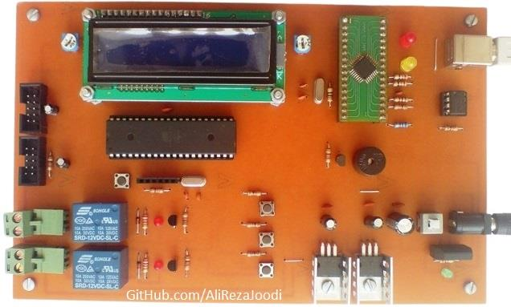
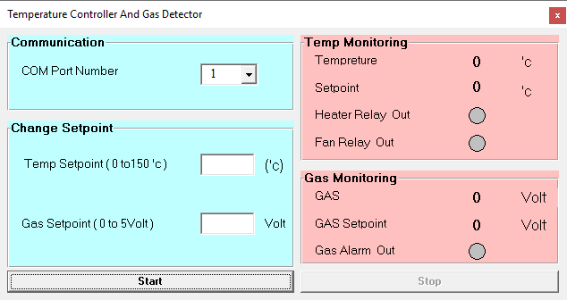
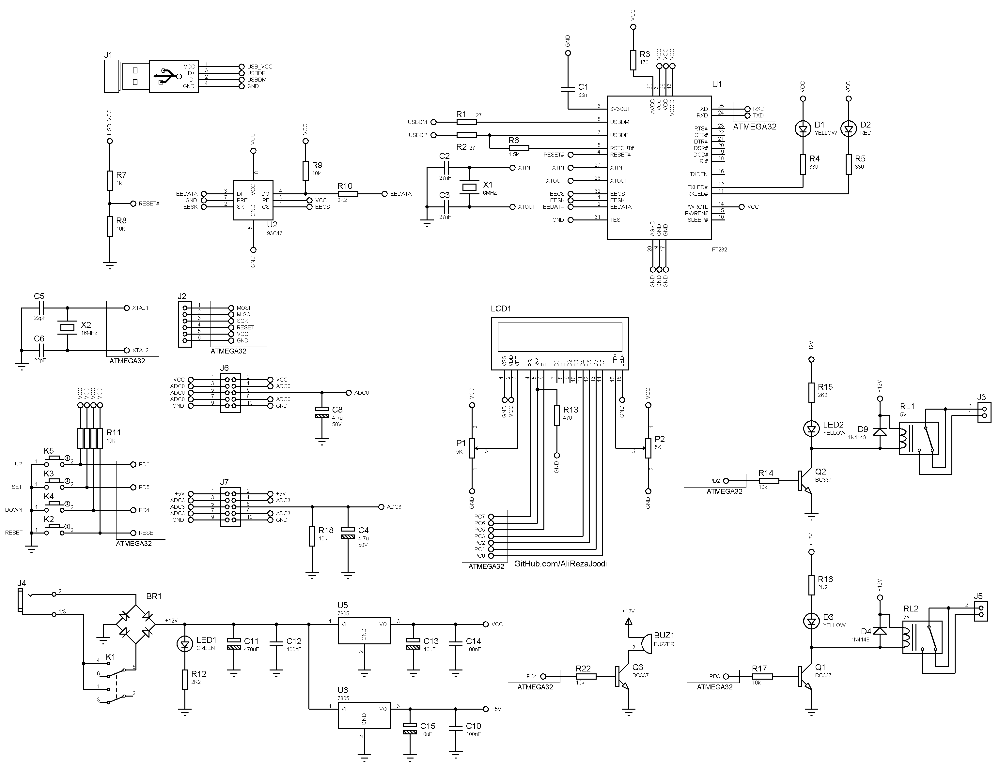

## Temperature Controller And Gas Detector With Computer Monitoring

MCU:        		ATmega32  
Temperature Sensor:     LM35  
Gas Sensor:     	MQ9  
Display:    		16x2 Character LCD  
Output:			Relay x2   
Computer Interfacing:	UART to USB Converter with FT232BL  
Computer Software:	VB6  

Note: Included schematic and PCB layout with Proteus.  
Note: It's a prototype and should get better.  

### Folder and Files Description
It has included:
- `Code_BascomAVR` (Code with Basic Language)
- `Code_VB6` (Software with Visual Basic)
- `Hardware` (Included hardware laye)
- `Pictures` (Photos Samples Made)

### Main Board: v1.0

### Software: v1.0

### Schematic: v1.0

My GitHub Account: [GitHub.com/AliRezaJoodi](https://github.com/AliRezaJoodi)  
**Note**: [You can go here to download a single folder or file from GitHub.com](https://minhaskamal.github.io/DownGit/#/home)
