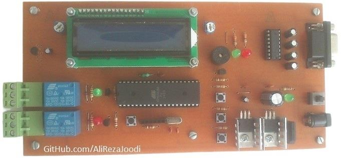
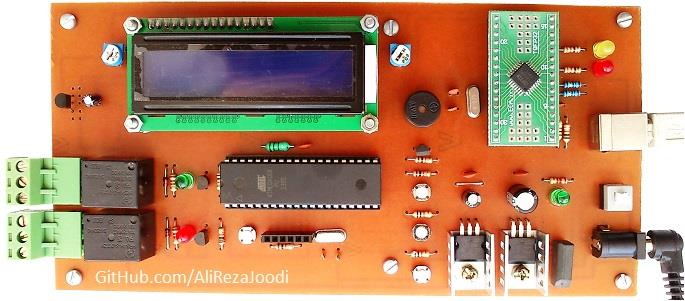
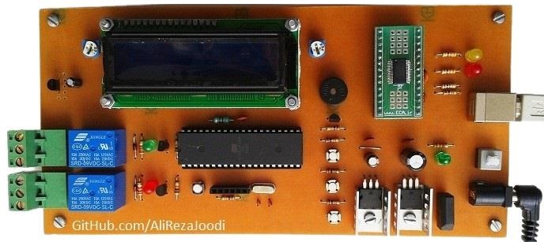
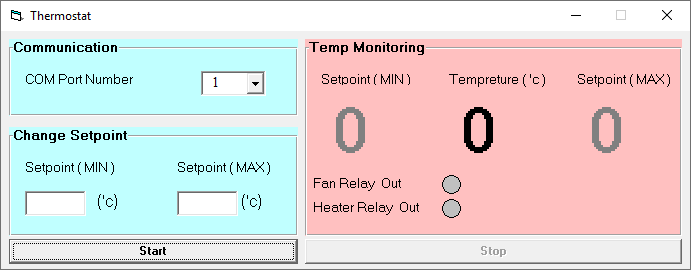
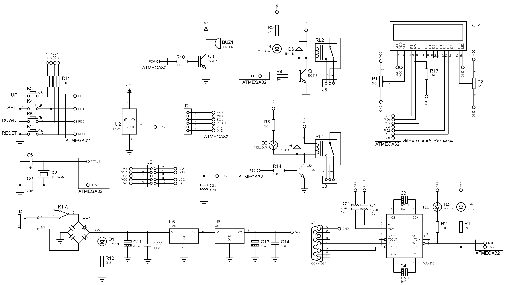

## Temperature Controller With Computer
  
MCU:        		ATmega32  
Sensor:     		LM35  
Display:    		16x2 Character LCD  
Output:			Relay	x2
Computer Interfacing:	RS232 to UART Converter with MAX232
Computer Interfacing:	UART to USB Converter with FT232BL and FT232RL 
Computer Software:	VB6

Note: Included simulator, schematic and PCB layout with Proteus.  
Note: It's a prototype and should get better.  

### Folder and Files Description
It has included:
- `Code_BascomAVR` (Code with Basic Language)
- `Code_VB6` (Software with Visual Basic)
- `Hardware_RS232` (Included hardware laye)
- `Hardware_USB_FT232BL` (Included hardware laye)
- `Hardware_USB_FT232RL` (Included hardware laye)
- `Pictures` (Photos Samples Made)

### Picture, RS232 Driver with MAX232: v1.0

### Picture, USB Controller with FT232BL: v1.0

### Picture, USB Controller with FT232RL: v1.0

### Software: v1.0

### Schematic, RS232 Driver with MAX232: v1.0

### Schematic, USB Controller with FT232BL: v1.0

### Schematic, USB Controller with FT232RL: v1.0

My GitHub Account: [GitHub.com/AliRezaJoodi](https://github.com/AliRezaJoodi)  
**Note**: [You can go here to download a single folder or file from GitHub.com](https://minhaskamal.github.io/DownGit/#/home)
