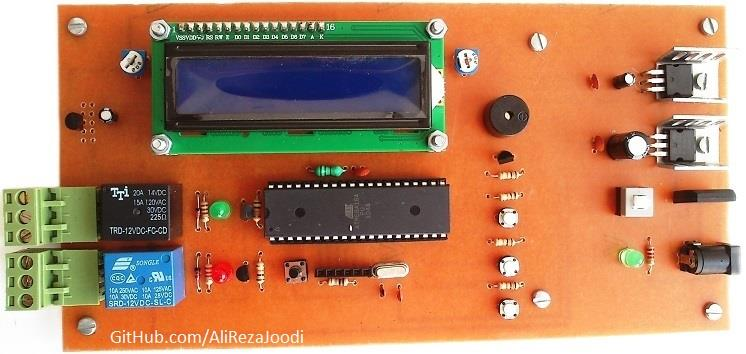
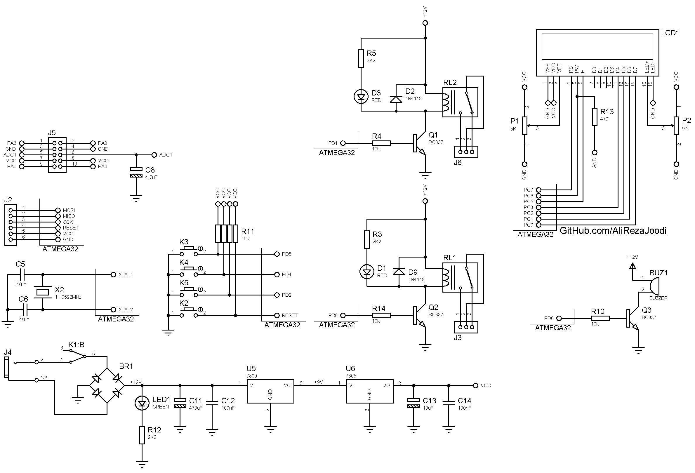

## Temperature Controller, 2 Relay outputs
  
MCU:        	ATmega32  
Sensor:     	LM35  
Display:    	16x2 Character LCD  
Output:		Relay	x2

Note: Included schematic and PCB layout with Proteus.  
Note: It's a prototype and should get better.  

### Folder and Files Description
It has included:
- `Hardware` (Included hardware laye)
- `Pictures` (Photos Samples Made)

Link for code: [TemperatureControllerWithComputer_2Outputs](TemperatureController_2Outputs_ComputerMonitoring) 

### Pictures: v1.0

### Schematic: v1.0

 

My GitHub Account: [GitHub.com/AliRezaJoodi](https://github.com/AliRezaJoodi)  
**Note**: [You can go here to download a single folder or file from GitHub.com](https://minhaskamal.github.io/DownGit/#/home)
