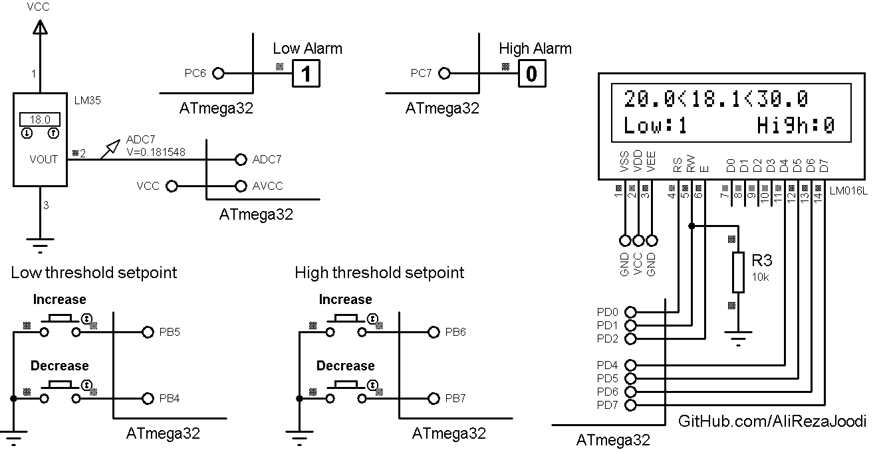

## Thermometer with LM35 Sensor and 2 Alarms
  
MCU:        ATmega32  
Display:    16x2 Character LCD  
Sensor:     LM35     

### Folder and Files Description
It has included:
- `Code_BascomAVR` (Code with Basic Language)
- `Simulate` (Simulator File)

### Simulate: v1.0

My GitHub Account: [GitHub.com/AliRezaJoodi](https://github.com/AliRezaJoodi)  
**Note**: [You can go here to download a single folder or file from GitHub.com](https://minhaskamal.github.io/DownGit/#/home)
