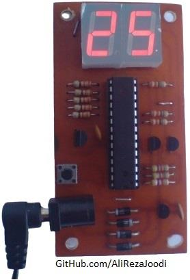
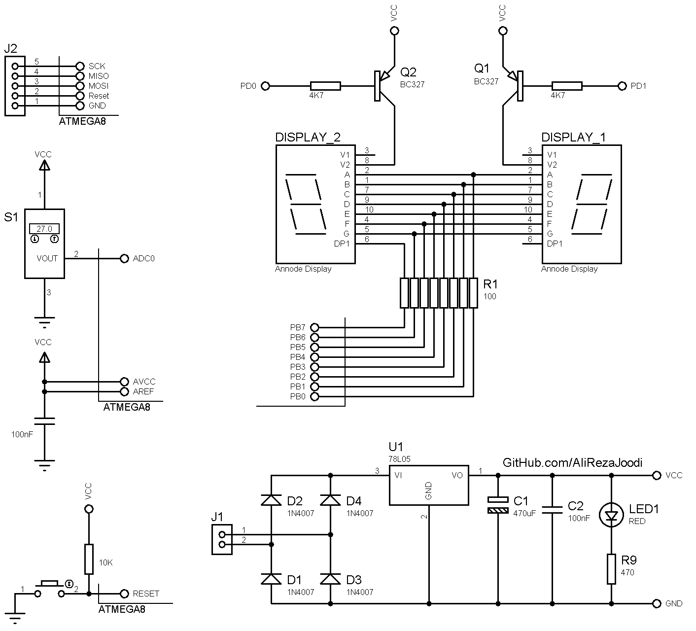

## Thermometer with LM35 Sensor, Display with 7-Segment
  
MCU: ATmega8  
Display: 2-Digit 7-Segment  
Sensor: LM35  
 
Note: Included simulator, schematic and PCB layout with Proteus.  
Note: It's a prototype and should get better. 

### Folder and Files Description
It has included:
- `Code_BascomAVR` (Code with Basic Language)
- `Hardware` (Included hardware laye)
- `Pictures` (Photos Samples Made)
- `Simulate` (Simulator File)

### Pictures: v1.1

### Schematic: v1.1

My GitHub Account: [GitHub.com/AliRezaJoodi](https://github.com/AliRezaJoodi)  
**Note**: [You can go here to download a single folder or file from GitHub.com](https://minhaskamal.github.io/DownGit/#/home)
