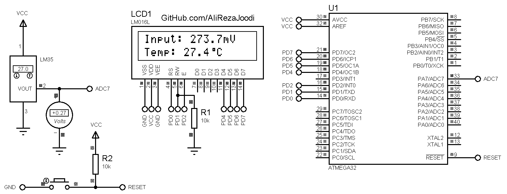

### Project Information
Title:               Thermometer Using LM35  
MCU:                 ATmega32  
Clock Frequency:     1.000000 MHz  
Voltage References:  AVCC (5V)  

### Folder and Files Information
It has included:
- `Code_BascomAVR` (Code with Basic Language)
- `Code_CodeVisionAVR` (Code with C Language)
- `Simulate` (Simulator File)

### Simulate: v1.0

My GitHub Account: [GitHub.com/AliRezaJoodi](https://github.com/AliRezaJoodi)  
**Note**: [You can go here to download a single folder or file from GitHub.com](https://minhaskamal.github.io/DownGit/#/home)
