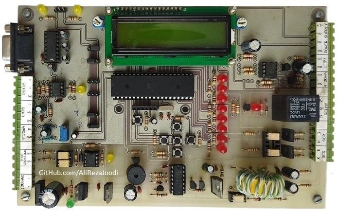
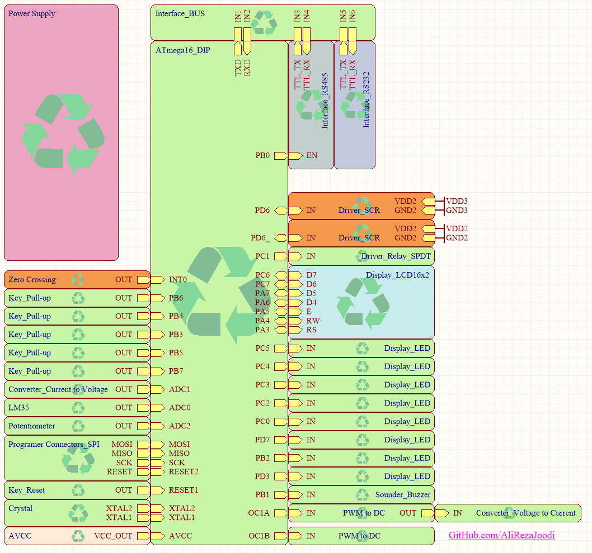
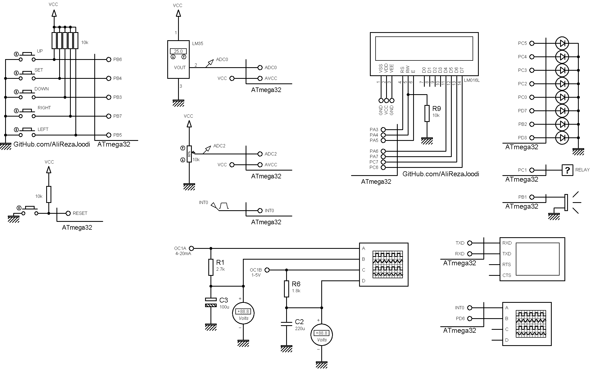

## AVR Training Board Exclusive for Dimmer

### Photo
v1.0  

### Features
- ATmega32 Microcontroller 
- Dual isolated power supply for SCR drivers
- SCR Gate Driver (2x)
- Zero Crossing Detector
- 4~20mA Analog Input
- 4~20mA Analog Output
- 0~5V Analog Output
- RS232
- RS485
- 16x2 Character LCD
- LED (8x)
- Buzzer
- LM35 Temp Sensor
- Potentiometer for ADC
- Button (5x)

### Folders and Files
This project includes:
- `Example` — Sample Codes
- `Hardware` — Schematic and PCB layout
- `Pictures` (Photos Samples Made)
- `Simulate` — Project photos

### Schematic
v1.0  

### Simulate
v1.0  

### More Information
**Note**: [You can go here to download a single folder or file from GitHub.com](https://minhaskamal.github.io/DownGit/#/home)  
My GitHub Account: [GitHub.com/AliRezaJoodi](https://github.com/AliRezaJoodi)  