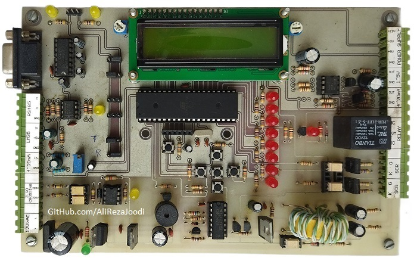
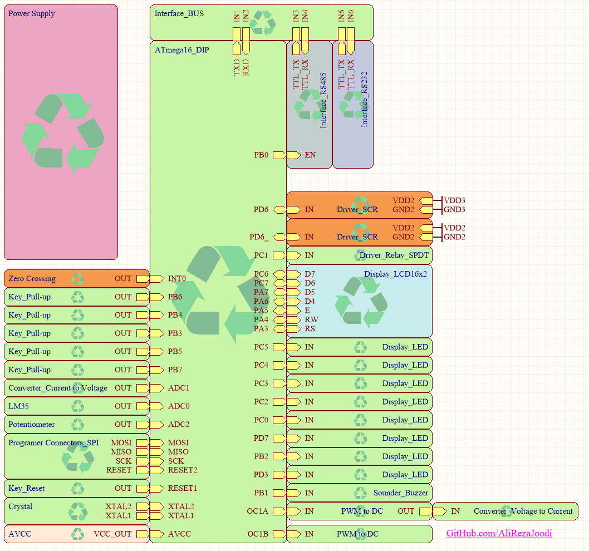
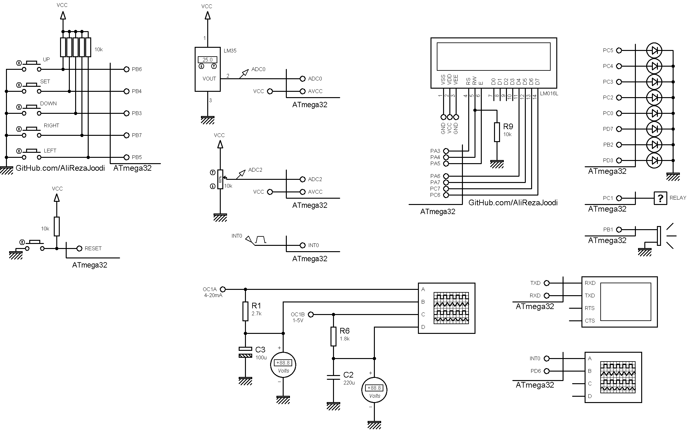

## AVR Training Board Exclusive for Dimmer

Features:
- ATmega32 Microcontroller 
- 11.059200MHz External Crystal
- Dual isolated power supply for SCR drivers
- SCR Gate Driver (2x)
- Zero Crossing Detector
- 4~20mA Analog Input
- 4~20mA Analog Output
- 0~5V Analog Output
- RS232
- RS485
- 16x2 Character LCD
- LED (8x)
- Buzzer
- LM35 Temp Sensor
- Potentiometer for ADC
- Button (5x)

### Folder and Files Description
It has included:
- `Example` (Sample Codes)
- `Hardware` (Included hardware layers)
- `Pictures` (Photos Samples Made)
- `Simulate` (Simulator File)

### Pictures: v1.0

### Schematic: v1.0

### Simulate: v1.0

My GitHub Account: [GitHub.com/AliRezaJoodi](https://github.com/AliRezaJoodi)  
**Note**: [You can go here to download a single folder or file from GitHub.com](https://minhaskamal.github.io/DownGit/#/home)
