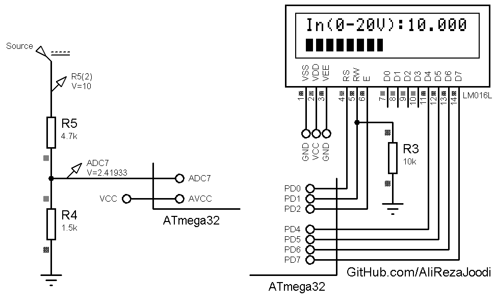
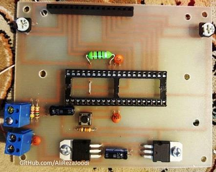

## Voltmeter With BarGraph On LCD For 0-20V/DC
 
MCU:        ATmega32  
Frequency:  1.000000 MHz  
VREF:       AVCC (5V)  
Display:    16x2 Character LCD

### Folder and Files Description
It has included:
- `Code_BascomAVR` (Code with Basic Language)
- `Hardware` (Hardware Layers)
- `Pictures` (Photos Samples Made)
- `Simulate` (Simulator File)

### Simulate: v1.0

### Pictures: v1.0

My GitHub Account: [GitHub.com/AliRezaJoodi](https://github.com/AliRezaJoodi)  
**Note**: [You can go here to download a single folder or file from GitHub.com](https://minhaskamal.github.io/DownGit/#/home)
