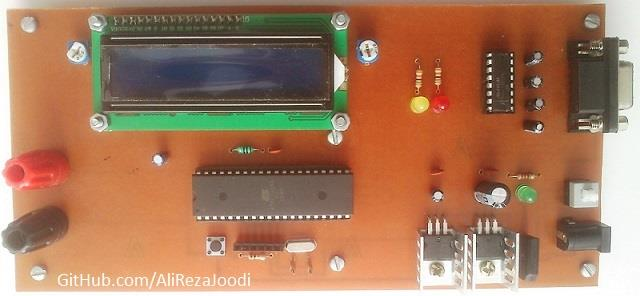
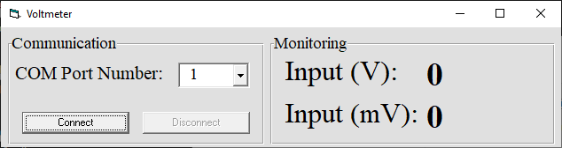
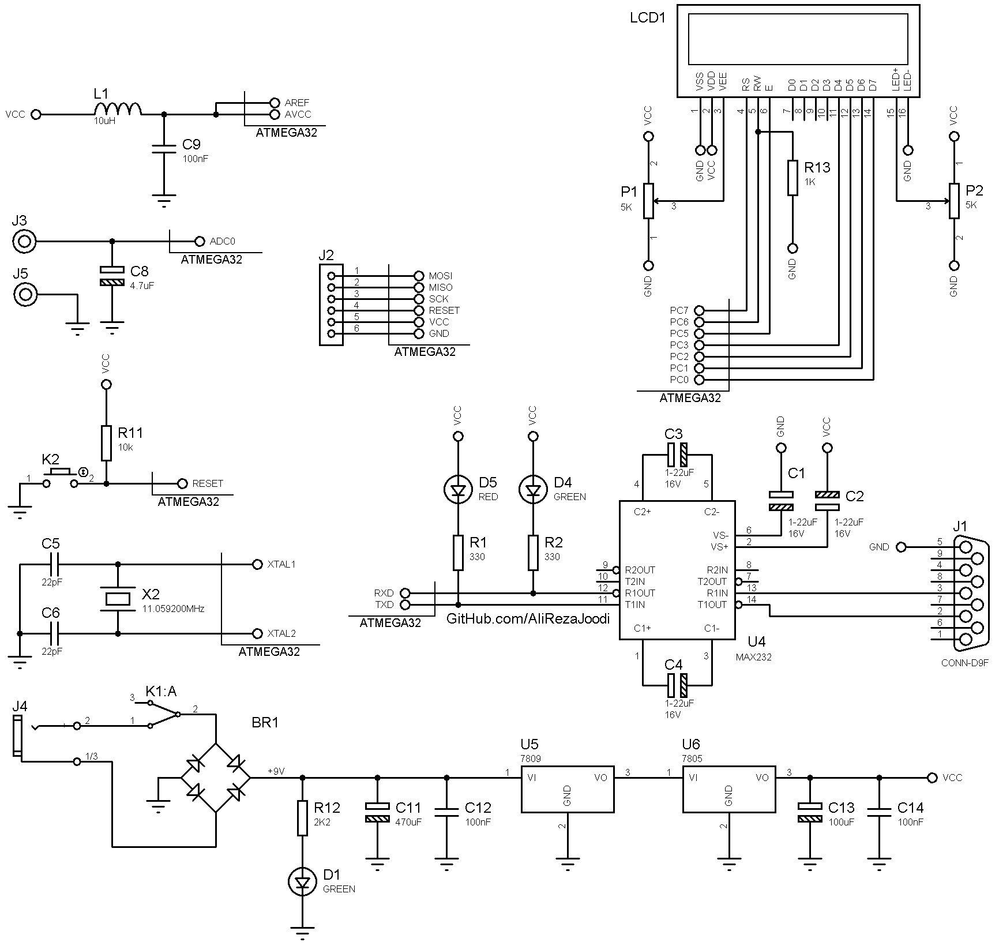
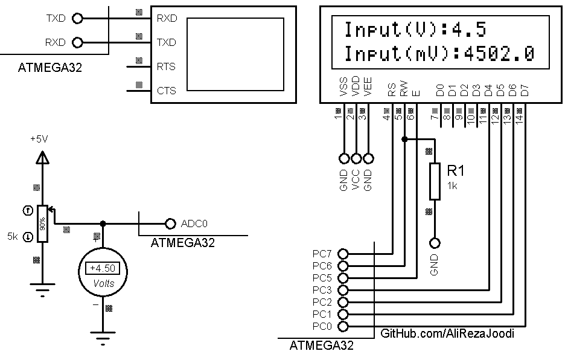

## 0-5V/DC Voltmeter with Computer Monitoring and LCD Display
	   
MCU:			ATmega32A  
Frequency:     		11.059200MHz (External Crystal)   
Display:        	16x2 LCD          
Input Voltage: 		0~5V DC  
Computer Interfacing:	UART to RS232 Converter  
Computer Software:	VB6  

Note: Frame format is String.  
Note: Included schematic and PCB layout with Proteus.  
Note: It's a prototype and should get better.  

### Folder and Files Description
It has included:
- `Code_BascomAVR` (Code with Basic Language)
- `Code_VB6` (Software with Visual Basic)
- `Hardware` (Included hardware layers)
- `Pictures` (Photos Samples Made)
- `Simulate` (Simulator File)

### Pictures: v1.0

### Software: v1.0

### Schematic: v1.0

### Simulate: v1.0

My GitHub Account: [GitHub.com/AliRezaJoodi](https://github.com/AliRezaJoodi)  
**Note**: [You can go here to download a single folder or file from GitHub.com](https://minhaskamal.github.io/DownGit/#/home)
