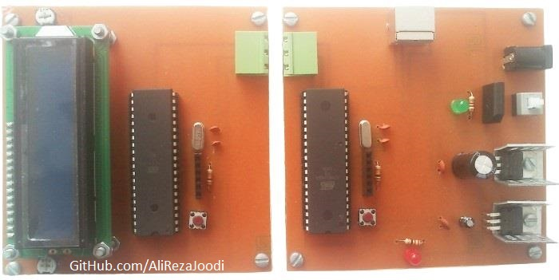
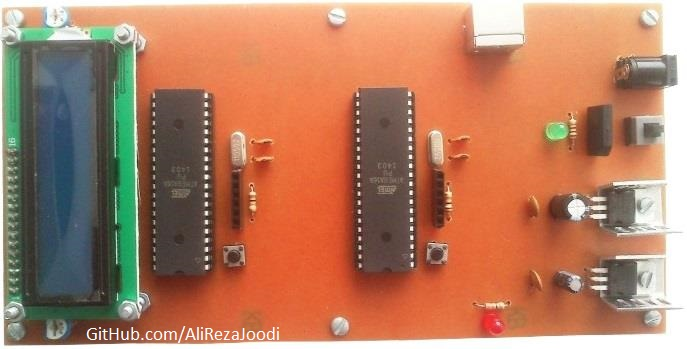
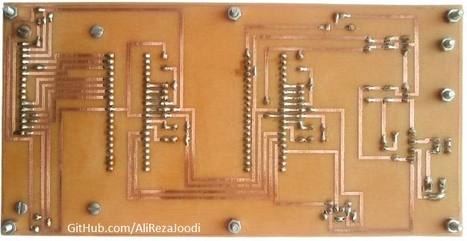
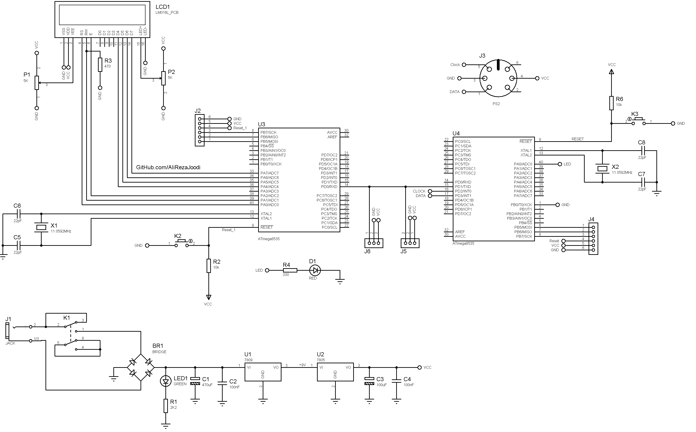

## Wired Communication With UART, From MCU to MCU, Typing With PS2 Keyboard

MCU:		ATmega32A  
Display:    	16x2 Character LCD
Input:		PS2 Keyboard  
    
Note: Included schematic and PCB layout with Proteus  
Note: It's a prototype and should get better 

### Folder and Files Description
It has included:
- `Code_BascomAVR` (Code with Basic Language)
- `Hardware` (Included hardware laye
- `Pictures` (Photos Samples Made)

### Pictures: v2.0

### Pictures: v1.0

### Pictures: v1.0, Bottom

### Schematic: v2.0

My GitHub Account: [GitHub.com/AliRezaJoodi](https://github.com/AliRezaJoodi)  
**Note**: [You can go here to download a single folder or file from GitHub.com](https://minhaskamal.github.io/DownGit/#/home)
