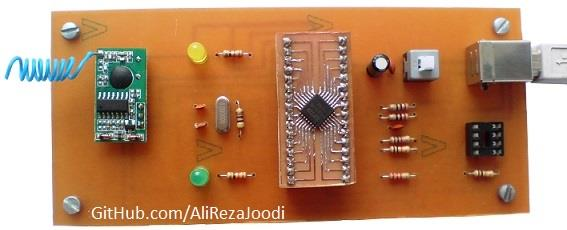
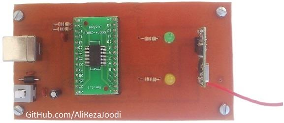
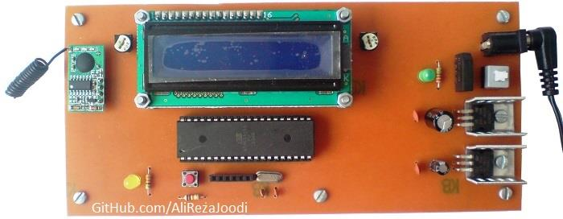
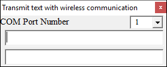
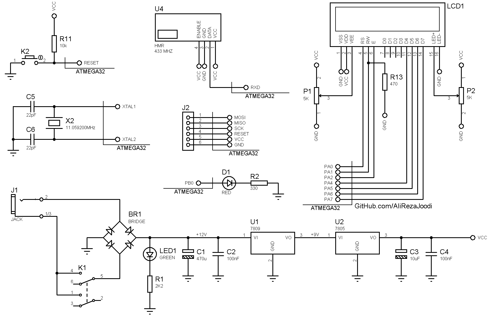

## Wireless Communication With RF, From Computer to MCU

MCU:			ATmega32A  
Display:    		16x2 Character LCD  
RF Module:		HMR and HMT Module  
Computer Interfacing:	UART to USB Converter with FT232  
Computer Software:	VB6
    
Note: Included schematic and PCB layout with Proteus  
Note: It's a prototype and should get better 

### Folder and Files Description
It has included:
- `Code_BascomAVR` (Code with Basic Language)
- `Code_VB6` (Software with Visual Basic)
- `Hardware` (Included hardware laye
- `Pictures` (Photos Samples Made)

### Pictures: TransferWithFT232BL_v1.0

### Pictures: TransferWithFT232RL_v1.0

### Pictures: Receiver_v1.0

Software: v1.0

### Schematic: TransferWithFT232BL_v1.0

### Schematic: TransferWithFT232RL_v1.0

### Schematic: Receiver_v1.0

My GitHub Account: [GitHub.com/AliRezaJoodi](https://github.com/AliRezaJoodi)  
**Note**: [You can go here to download a single folder or file from GitHub.com](https://minhaskamal.github.io/DownGit/#/home)
